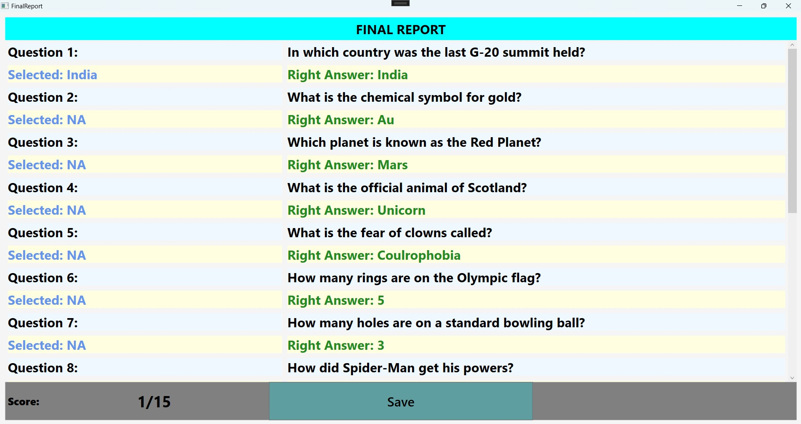

# Quiz Trivia

## Overview

The Quiz App is a feature-rich application built using Windows Presentation Foundation (WPF). It provides an engaging platform for users to test their knowledge by attempting quizzes. The app offers interactive features such as answer validation, skipping questions, game summary, and the ability to save results locally.

## Features

- **Question Navigation:**

  - Users can skip questions or proceed to the next one without answering.

  - Option to end the game at any time.

  - Answer Feedback: Displays whether the selected answer is correct or incorrect immediately after selection.

- **Game Summary: At the end of the quiz, users can view:**

  - All the questions attempted.

  - The correct answers.

  - The answers they selected.

  - Save Results: Ability to save the quiz results as a text file locally on the PC.

  - User-Friendly Interface: Clean, intuitive UI designed using WPF for smooth interaction.

## Technical Stack

- Framework: Windows Presentation Foundation (WPF)

- Language: C# (.NET Framework)

- Design Pattern: MVVM (Model-View-ViewModel) for separation of concerns and easy maintainability.

## How to Run

- Clone the repository:

git clone https://github.com/yourusername/quiz-app-wpf.git

- Open the solution file (QuizApp.sln) in Visual Studio.

- Build the solution to restore dependencies.

- Run the application using the "Start" button in Visual Studio.

## How to Use

- Launch the app.

- Start the quiz by clicking the "Start Quiz" button.

- Navigate through the questions using the Next button or skip answering if desired.

- End the game whenever you wish using the End Quiz button.

- View the summary of all questions, including correct answers and selected answers.

- Save the result locally by clicking the Save Results button.

## Future Enhancements

- Custom Question Sets: Allow users to import their own question sets.

- Timer Feature: Add a timer to limit the time for each question.

- Score Tracker: Display scores dynamically as the quiz progresses.

- Themes: Introduce dark/light mode for enhanced user experience.

- Multiplayer Mode: Add support for competing with other users in real-time.

## Credits

- Developer: Palak Sharma

- Technology: WPF, .NET Framework, C#

- Inspiration: Designed to make learning and assessment fun and interactive.

## License

This project is licensed under the MIT License. See the LICENSE file for more details.
